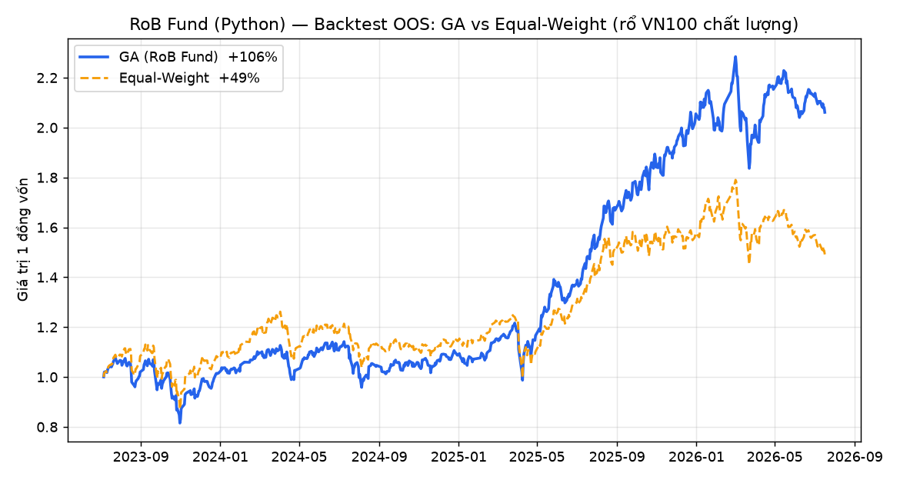

# RoB Fund — Quant Engine (Python)

> Bản Python của lõi định lượng **RoB Fund** — screener chiến lược + tối ưu danh mục bằng
> **thuật toán di truyền (GA)** + backtest walk-forward, quét **toàn thị trường chứng khoán
> Việt Nam** bằng dữ liệu thật.
> Project cá nhân môn **Applied Big Data in Finance**.

Đây là bản **viết lại bằng Python** phần "bộ não" của sản phẩm RoB Fund (bản gốc là web app
HTML/JS). Mục tiêu: một codebase Python sạch, **chạy được ngay tại lớp** (kể cả offline nhờ
dữ liệu đã cache trong repo).

---

## 🚀 Chạy nhanh

```bash
pip install -r requirements.txt

python run_demo.py        # Demo nhanh, CHẠY OFFLINE bằng dữ liệu cache (~5 giây)
python run_bigdata.py     # Quét TOÀN THỊ TRƯỜNG (~1.500 mã) từ cache

# Kéo dữ liệu mới nhất từ VNDIRECT (cần internet):
python run_demo.py --refresh
python run_bigdata.py --refresh
```

Yêu cầu: Python 3.10+ · pandas · numpy · matplotlib.

---

## 🧠 Phương pháp

| Thành phần | File | Mô tả |
|---|---|---|
| **Screener cơ bản** | `robfund/screeners.py` | Graham Defensive · Greenblatt Magic Formula · Piotroski F-Score |
| **Screener kỹ thuật** | `robfund/screeners_price.py` | Minervini Trend Template (8 tiêu chí) · Momentum 12-1 (Jegadeesh–Titman) |
| **Lọc thanh khoản** | `robfund/liquidity.py` | ADTV ≥ 1 tỷ/phiên · giá ≥ 5.000đ · loại UPCOM |
| **Tối ưu danh mục (GA)** | `robfund/optimizer.py` | Thuật toán di truyền tối đa hoá Sharpe, trần tỷ trọng 20%, co ngót (shrinkage) về equal-weight |
| **Backtest** | `robfund/backtest.py` | Walk-forward (in-sample 252 / out-of-sample 63 phiên) + Sharpe/CAGR/Max Drawdown |
| **Dữ liệu** | `robfund/data.py`, `robfund/universe.py` | Kéo giá + khối lượng song song (thread pool) từ VNDIRECT, cache đĩa |

**Thuật toán di truyền (GA)** — mỗi cá thể là một vector tỷ trọng danh mục; quần thể tiến hoá
qua chọn lọc (tournament) · lai ghép số học · đột biến · elitism, với hàm mục tiêu là **Sharpe
in-sample**. Có **shrinkage về danh mục đều** để ép kỷ luật và chống overfit. Cố định `seed`
để **tái lập** kết quả.

---

## 📊 Kết quả (dữ liệu thật, out-of-sample)

**1) `run_demo.py` — rổ VN100 chất lượng (12 mã Piotroski F≥7):**

| Chiến lược | Tổng LN | CAGR | Sharpe | Max Drawdown |
|---|---|---|---|---|
| **GA (RoB Fund)** | **+106%** | **27.3%** | **1.16** | −24.4% |
| Equal-Weight | +49% | 14.3% | 0.70 | −22.9% |

→ Trên rổ cổ phiếu chất lượng, GA **cải thiện Sharpe rõ rệt** (1.16 vs 0.70).



**2) `run_bigdata.py` — quét toàn thị trường:**

- **1.514 mã × 1.428 phiên ≈ 2,1 triệu điểm giá** kéo trong ~75 giây (song song 16 luồng).
- Bộ lọc thanh khoản: **1.514 → 226 mã** đầu tư được.

---

## 🔍 Phát hiện quan trọng (đưa vào report)

Khi backtest nhóm **momentum toàn thị trường CHƯA lọc thanh khoản**, GA/momentum "thắng ảo"
nhờ trúng **micro-cap illiquid đã tăng phi mã** (có mã momentum 12-1 tới **+700%**, giá vài
trăm đồng) — những mã **không đầu tư được ở quy mô thật**.

→ Bài học: **kết quả cực nhạy với cách dựng vũ trụ đầu tư**, và **bộ lọc thanh khoản là bắt
buộc** trước khi tin bất kỳ backtest nào. GA thể hiện giá trị **trên rổ cổ phiếu chất lượng &
thanh khoản**, không phải trên rổ "hàng đã bay".

---

## 📁 Cấu trúc

```
robfund/           # package lõi (data, screeners, optimizer, backtest, liquidity, viz)
data/              # dữ liệu thật đã cache (chạy offline): bctc.json, prices_*.csv, adtv_*.csv
run_demo.py        # demo nhanh, offline
run_bigdata.py     # quét toàn thị trường
requirements.txt
```

---

## 📦 Dữ liệu

Nguồn: **VNDIRECT** (public API) — giá/khối lượng lịch sử (`dchart`), báo cáo tài chính &
tỷ số (`financial_statements`, `ratios`), danh sách niêm yết (`stocks`). Dữ liệu đã được
**cache sẵn trong `data/`** để repo chạy được ngay mà không cần internet.

---

## ⚠️ Miễn trừ trách nhiệm

Đây là **bài tập học thuật/nghiên cứu định lượng**, **KHÔNG phải khuyến nghị đầu tư**.
Backtest quá khứ **không đảm bảo** kết quả tương lai. Thuật toán di truyền có yếu tố ngẫu
nhiên (đã cố định seed để tái lập). Chưa tính đầy đủ phí giao dịch/trượt giá/thuế.

---

*Bản gốc RoB Fund (web app) được giữ nguyên, không sửa đổi. Repo này chỉ tái tạo phần engine
định lượng bằng Python cho mục đích học thuật.*
